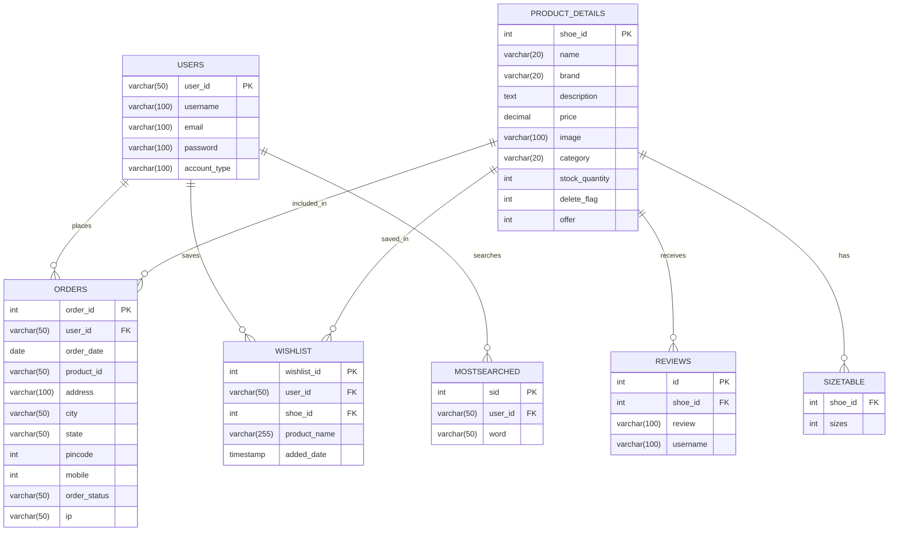

# THE FIND — Premium E-Commerce Shoe Platform

[](https://github.com/)
[](https://github.com/)
[](http://www.fpdf.org/)

**THE FIND** is a fully functional, database-driven E-Commerce web application developed as a Bachelor of Computer Applications (BCA) mini-project. The platform is designed specifically for online shoe retail, featuring a dual-portal architecture: a dynamic customer shopping experience and a comprehensive administrative control panel.

---

##  Table of Contents
1. [Key Features](#-key-features)
2. [Technology Stack](#-technology-stack)
3. [Database Architecture](#-database-architecture)
4. [File & Directory Structure](#-file--directory-structure)
5. [Prerequisites & Installation](#-prerequisites--installation)
6. [Usage & Test Accounts](#-usage--test-accounts)
7. [Academic Metadata](#-academic-metadata)

---

##  Key Features

###  Customer Portal
*   **User Authentication & Security:** Secure registration (`signup.php`) and login (`login.php`) powered by PHP sessions.
*   **Dynamic Catalog Browsing:** View available shoes (`products.php`) with real-time stock status display (e.g., "In Stock", "Only 1 Stock Left", or "Out of Stock").
*   **Search & Multi-Level Filtering:** 
    *   Search by product name.
    *   Filter by category (sneaker, sports, boots, etc.).
    *   Sort by Brand, Price (Low to High), and Price (High to Low).
*   **Wishlist Management:** Add favorite products to wishlist and manage them from the account dashboard.
*   **Product Reviews:** View and submit customer reviews on product detail pages to share feedback.
*   **Order Checkout:** Easy checkout page supporting Cash on Delivery (CoD) with real-time address validation, stock verification, and duplicate order prevention.
*   **PDF Invoice Generation:** Automated billing invoice (`generate_invoice.php`) using the FPDF library, downloadable instantly upon placing an order.

###  Administrative Control Panel
*   **CRUD Inventory Management:** Insert, view, update, and soft-delete products (`insert.php` & `products.php`).
*   **Business Intelligence & Analytics:**
    *   **Most Searched Items:** Tracks and displays high-frequency search keywords to analyze customer interest.
    *   **Most Sold Items:** Highlights the top-performing shoe models based on completed transaction volume.
*   **Order Operations:** Monitored listing of all user orders, featuring:
    *   Real-time order status updates (Pending, Shipped, Delivered, Cancelled).
    *   Audit-ready security log capturing the customer's IP address (`$_SERVER['REMOTE_ADDR']`).
*   **Report Generation:** One-click CSV report compilation (`generate_report.php`) containing entire order records for offline analysis.

---

##  Technology Stack

*   **Frontend:** HTML5, CSS3 (Custom styling via dedicated `.css` modules), and JavaScript (for interactive client greeting alerts).
*   **Backend:** PHP (Object-oriented and procedural mysqli database interactions).
*   **Database:** MySQL (Relational Schema design with constraints and referential integrity).
*   **PDF Rendering Engine:** FPDF (Free PDF PHP class library).

---

##  Database Architecture

The system utilizes a relational database structure designed to enforce integrity rules with foreign key constraints.



### Table Dictionary
1.  **`users`**: Stores client and administrator accounts.
2.  **`product_details`**: Contains the inventory catalog including prices, categories, and stock quantities.
3.  **`orders`**: Holds orders placed, delivery addresses, order statuses, and ordering client IP addresses.
4.  **`reviews`**: Aggregates user-submitted feedback on specific products.
5.  **`wishlist`**: Links users to their saved/bookmarked products.
6.  **`sizetable`**: Maps shoe sizes to corresponding product catalog items.
7.  **`mostsearched`**: Stores query terms entered by users to compute popular catalog search trends.

---

##  File & Directory Structure

```text
E-COMMERCE_SITE/
│
├── database/
│   └── miniproject.sql              # Database schema and initial seed data
│
├── doc/                             # FPDF library documentation files
│
├── font/                            # Core font definitions for PDF invoice export
│
├── image/                           # Product catalog images, logos, and UI icons
│
├── makefont/                        # Custom font converter scripts for FPDF
│
├── tutorial/                        # FPDF implementation guides and code snippets
│
├── fpdf.php                         # Core FPDF class file
│
├── home.php / homestyle.css         # Front page greeting, store banners, and primary nav
│
├── products.php / productstyle.css  # Catalog browsing interface with search & filters
│
├── productdetails.php / ...style    # Specific product descriptions, stock status, and reviews
│
├── about.php / aboutstyle.css       # Corporate profile page
│
├── signup.php / signupstyle.css     # New customer registration forms and controller
│
├── login.php / loginstyle.css       # Portal login with security session initialization
│
├── logout.php                       # PHP Session termination script
│
├── add_to_cart.php                  # Adds products directly to processing channels
│
├── remove_from_wishlist.php         # Customer dashboard wishlist cleanup logic
│
├── ordering.php / orderingstyle.css # Shipping detail entry and checkout controller
│
├── orderplaced.php / ...style       # Order confirmation page with invoice link
│
├── generate_invoice.php             # Compiles purchase details into a printable PDF
│
├── generate_report.php              # Compiles storewide transactions into a CSV file
│
├── insert.php / insertstyle.css     # Administrator's new product registration interface
│
└── update_order_status.php          # Admin portal dialog to manage shipping pipeline states
```

---

##  Prerequisites & Installation

### Prerequisites
*   A local server environment supporting PHP (7.4+ or 8.x) and MySQL. Recommended software: **XAMPP**, **WAMP**, or **MAMP**.

### Installation Steps

1.  **Clone / Download the Repository:**
    Extract the repository folder and rename it to `E-COMMERCE_SITE`. Place it in your server's root directory:
    *   **XAMPP:** `C:/xampp/htdocs/E-COMMERCE_SITE`
    *   **WAMP:** `C:/wamp64/www/E-COMMERCE_SITE`

2.  **Start Services:**
    Launch the XAMPP Control Panel and start both **Apache** and **MySQL**.

3.  **Setup Database:**
    *   Open your browser and navigate to `http://localhost/phpmyadmin/`.
    *   Click **New** and create a database named `miniproject`.
    *   Select the `miniproject` database, click the **Import** tab.
    *   Choose the file `database/miniproject.sql` from your project folder and click **Import** (or **Go**).

4.  **Launch the Application:**
    Navigate to `http://localhost/E-COMMERCE_SITE/home.php` in your web browser.

---

##  Usage & Test Accounts

You can test the application functions using these pre-seeded accounts included in the database:

| Portal Role | Username | Password | Account Type |
| :--- | :--- | :--- | :--- |
| **Administrator** | `abibinu` | `abibinu` | `admin` |
| **Customer** | `abi` | `password` | `user` |
| **Customer** | `hello` | `hello` | `user` |

---

##  Academic Metadata

*   **Project Title:** THE FIND — Shoe E-Commerce Website
*   **Course:** Bachelor of Computer Applications (BCA)
*   **Project Classification:** BCA Mini Project (Semester V)
*   **Primary Technologies:** PHP, MySQL, CSS, FPDF
